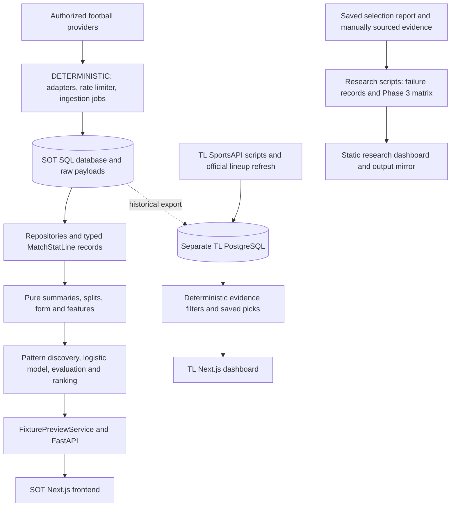
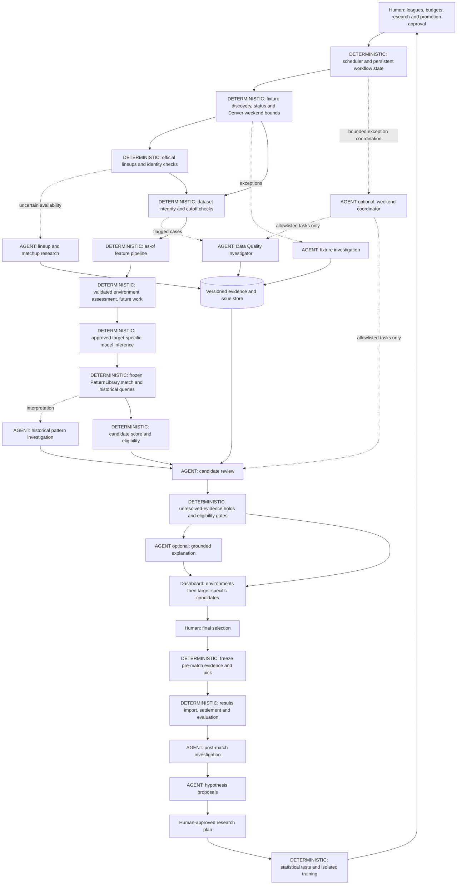

# Proposed agent architecture

26 September 2026. Design proposal only; no agent or application changes implemented. Root aliases SOT, TL, R and M are defined in [the audit](AGENT_OPPORTUNITY_AUDIT.md).

## 1. Architectural decision

Use the original SOT backend as the proposed home for agent-facing tools: it already has typed Python analytics, repositories, provider adapters, structured schemas, diagnostics and logging. Keep the pure `backend/app/analytics` package independent of agents and external tools. TL remains a separate consumer until an explicit integration project reconciles its IDs, targets, lineup policy and saved-pick records. R remains an evidence source; its selected ticket history should not automatically become training data.

The first implementation should be one read-only investigator, not a multi-agent framework. A deterministic runner supplies the task, permitted tools, budget and evidence snapshot. The agent investigates flagged issues and returns a schema-validated report. Existing services still calculate every statistic.

No framework/vendor selection is necessary for this audit. No new vector database, distributed queue or hosted agent platform is justified for the initial workflow.

## 2. Current architecture



There is no existing central weekend orchestrator connecting all three systems. SOT's preview service currently fits a model during a request; the diagram is a dependency map, not a claim of persisted production inference.

## 3. First implementation boundary

```text
Human requests data-quality audit
  -> deterministic runner fixes dataset snapshot, league, cutoff, tool/cost limits
  -> existing repository + audit_historical_dataset produce diagnostics
  -> AGENT: Data Quality Investigator chooses bounded evidence follow-ups
  -> DETERMINISTIC: validate report schema, source references and numeric claims
  -> append audit report + action trace
  -> human reviews any proposed canonical correction
```

The agent has no database write, model-fit, settlement, pick-finalization or configuration tool. Its only writes are audit artifacts and action logs. If a tool is unavailable, output a partial report with the blocked step and remaining evidence requirements.

## 4. Eventual system, after the roadmap gates

Boxes marked AGENT involve evidence-based decisions or synthesis. Everything else is deterministic, including scheduling and pipeline order. Dashed arrows represent proposed integrations.



Environment-first ranking is the user's intended destination. Current SOT code supplies team/opponent context within player scoring; no separately validated environment ranking engine was identified. The future environment assessment above is a deterministic research deliverable, not an agent that invents environment scores. Keep this explicit so the architecture does not imply it already exists.

## 5. Reuse and tool contracts

All tool names below are proposed wrappers, not existing functions. Prefer direct typed backend calls; do not make the LLM construct SQL, shell commands or arbitrary URLs.

| Proposed tool | Existing implementation to call | Side effects / restrictions |
|---|---|---|
| `read_dataset_audit` | `PlayerMatchRepository.list_all_finished`, `PreMatchFeatureBuilder.build_historical`, `audit_historical_dataset`, `audit_as_dict` | Read-only snapshot; returns coverage/sample limitations, not replay certification. |
| `read_historical_records` | `historical_dataset_records`, repository filters, `/api/admin/datasets/sot-records` | Bounded page/league/date query; explicit entity namespace. |
| `read_player_evidence` | `PlayerAnalyticsService.get_matches/get_summary/get_splits/get_streaks`, `PlayerRepository.get/search` | Return sample sizes, missing counts and source keys. |
| `read_fixture_evidence` | Fixture models/repository queries and `api/routes/fixtures.py` | Status/kickoff history; no call to preview training route for a simple lookup. |
| `read_ingestion_diagnostics` | `IngestionJob`, `LeagueResearchState`, stored `provider_raw_data` | Redacted records; current raw payload is not an immutable history. |
| `read_research_case` | R saved JSON matrix/failure/evidence files | File allowlist; do not execute or import side-effectful research builders. |
| `read_tl_evidence` | TL `weekendCandidates` and `models/weekend.ts:evidence` via a future restricted service/export | Preserve TL policy/target labels and UUID namespace. No `trackPick` access. |
| `research_source` | Approved provider adapter or allowlisted read-only web tool | Bounded requests; retain retrieved/published timestamps, excerpts and identity. External content is untrusted data. |
| `match_patterns` | Frozen `PatternLibrary.match` | Target and artifact/version fixed; no fitting/mining hidden inside lookup. |
| `predict_approved` | Approved `LogisticSotModel.predict_many` and `SotEngineArtifact.rank` | Future immutable artifact required. Currently 1+ SOT; other targets return unavailable. |
| `read_postmatch_diagnostics` | `analyze_high_confidence_failures`, `evaluate_probabilities`, frozen TL outcome records | Outcome labels remain deterministic; agent reasons are hypotheses. |
| `write_audit_report` | New append-only audit writer | Only designated report/log store, no canonical updates. |

Private methods such as `_defensive_context`, `_qualification`, `_upsert_player` and `_explanations` identify reusable implementation logic. Call the enclosing service/public entry point where safe; expose a narrow public wrapper later if needed. Do not duplicate these methods in prompts.

## 6. Minimum evidence contract

A future typed evidence packet should carry:

- `run_id`, `schema_version`, `tool_version`, `dataset_snapshot_id`, content hash and actual `generated_at`.
- Entity namespace, provider, player ID, fixture ID, team ID, opponent ID and candidate ticket link status.
- Explicit `target`: `shots_1_plus`, `shots_2_plus` or `sot_1_plus`; never an ambiguous `combined` label.
- Kickoff, actual evaluation cutoff, `feature_as_of`, and source publication/retrieval/availability timestamps. Unknown timestamps are nullable.
- Metrics with value, unit, numerator/denominator, missing count, window, cohort and calculation method.
- Model output with artifact ID, target, training period, calibration/evaluation status and feature schema; keep raw model probability separate from heuristic blended scores.
- Each source claim linked to the exact field, original value, normalized value, source identifier, capture hash and confidence reason.
- `status`: supported, missing, provisional, conflicting or unavailable. A confidence label is not a probability.
- Agent output references to existing fields and sources, plus recommendation/hold/proposed correction and unresolved alternatives.

For shot share, the denominator must say `full_match_team_shots` or `team_shots_while_player_on_field`. These are different measurements. The existing Phase 3 value uses full-match team shots.

## 7. Justified infrastructure

| Infrastructure | Already available | Minimum addition / timing |
|---|---|---|
| Typed schemas/tool interfaces | SOT dataclasses, Pydantic schemas, FastAPI, provider protocol | Stage 1: audit issue/evidence/tool-result schemas and allowlisted wrappers. |
| Source provenance | Raw provider payloads, source labels, R URLs/pages | Stage 1: field/source links and immutable report input hashes; versioned canonical observations before strict replay. |
| Logs and trace IDs | Structured logging, ingestion jobs, TL sync logs | Stage 1: run/action IDs, tool outcome references, model/prompt versions, latency/cost and redaction. |
| Permissions | Protected admin endpoints, TL local-origin checks | Stage 1: dedicated read-only capability gateway/session. Existing admin token must not become general agent access. |
| Evaluation framework | Extensive deterministic tests | Stage 1: judged anomaly cases, unsupported-claim checks, tool-permission tests and replay fixtures. |
| Workflow state and retry | `LeagueResearchState`, `IngestionJob`, provider limiter/retries, rollover checkpoints | Reuse. Stage 2: durable bounded run/job records with leases, idempotency and deadline. Start with current SQL store. |
| Scheduler / queue | Manual CLIs and on-demand refresh | Stage 2: one scheduler/worker initially. Add an external queue only if concurrent load/recovery needs justify it. |
| Model registry | League readiness/threshold records and in-memory engine artifact | Stage 2 prerequisite: approved immutable model artifact manifest with hash, target, schema and evaluation. League status alone is not a registry of model binaries. |
| Feature store | Deterministic feature builder; TL schema has snapshot tables | Start with versioned snapshots in existing storage; no separate feature-store product required. |
| API abstraction | SOT `FootballDataProvider` and factory already exist | Reuse rather than create a second generic football client. Bridge TL only after explicit integration decision. |
| Cache | Provider/service/query caches, TL completion-count heuristic | Cache key must include data/artifact version, target, cutoff and policy; fix incomplete-record heuristic separately. |
| Vector database | None found | Not recommended now. Structured IDs/filters and `PatternLibrary.match` suit numerical history. Reassess only for a large corpus of qualitative documents. |
| Confidence | Quality fields, sample gates, Wilson metrics, candidate confidence already exist | Reuse numerical evidence; distinguish source confidence, data completeness and model uncertainty. Do not add an LLM confidence percentage. |

## 8. Target coverage and policy boundaries

SOT's logistic labels and pattern engine use `sot_1_plus`; SOT summary thresholds 2+/3+ refer to SOT, not total shots. TL explicitly supports `shots1`, `shots2`, `sot1` as observed-rate filters. R Phase 3 covers selected 2+ shots outcomes. Target alignment is a prerequisite for shared screening.

A human controls canonical identity corrections, acceptance of new evidence into training, provider/league spending, experiment plans, trained model promotion, scoring/qualification thresholds, release decisions and final picks. A scheduler may refresh authorized data; an agent may investigate and propose. Neither gets authority from text returned by an external source.

On provider disagreement, unavailable approved model, insufficient sample, unresolved team identity, missing time provenance or failed numeric validation, the workflow emits a hold with a traceable reason. It must never pad a shortlist or relax rules to produce a desired number of candidates.

The same 15 reliability rules in the audit apply to every proposed component. The exact staged implementation and acceptance gates are in [the roadmap](AGENT_IMPLEMENTATION_ROADMAP.md).
